# Lab7Web

Nama		: M Surya
Kelas 		: TI.19.B.1
NIM		: 311910811

Menjalankan Web Server
Untuk menjalankan web server dari menu XAMPP Control.

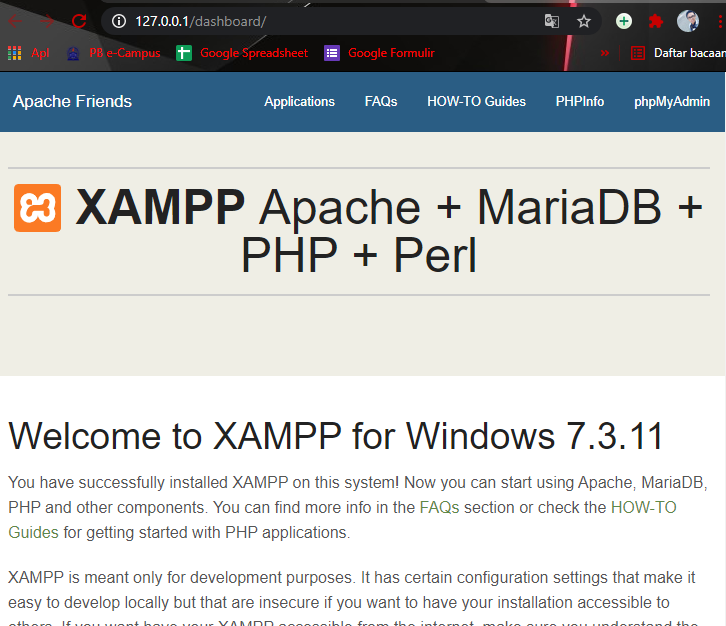

Memulai PHP
Buat folder lab7_php_dasar pada root directory web server (d:\xampp\htdocs)

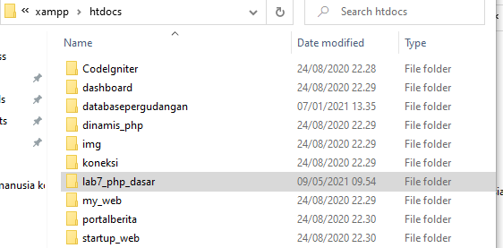

Kemudian untuk mengakses direktory tersebut pada web server dengan mengakses URL:
http://localhost/lab7_php_dasar/

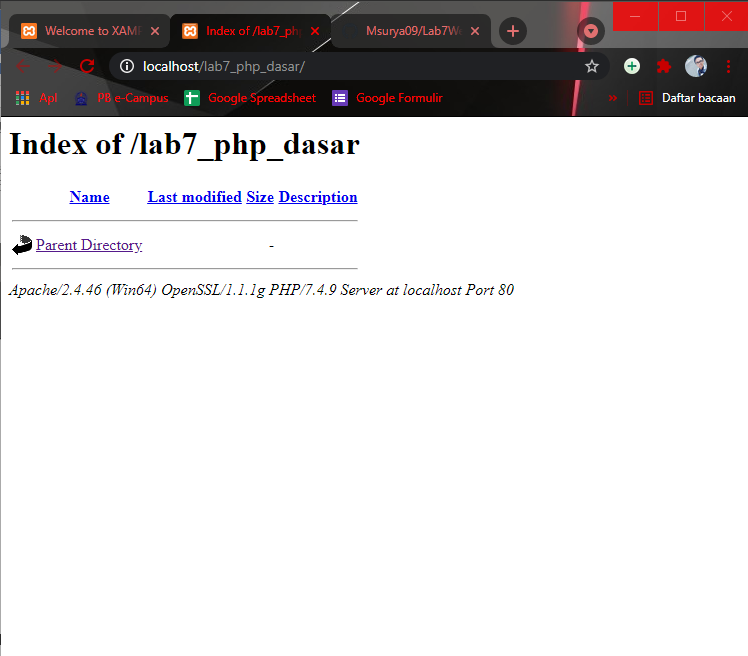

PHP Dasar
Buat file baru dengan nama php_dasar.php pada directory tersebut. Kemudian buat kode seperti berikut

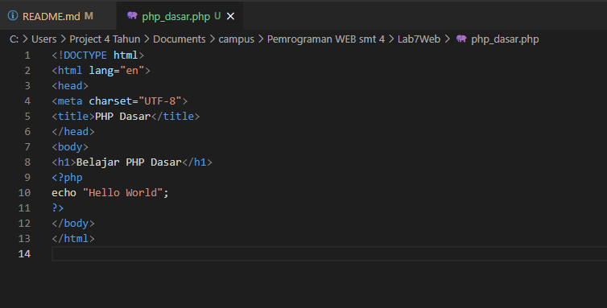

Kemudian untuk mengakses hasilnya melalui URL:
http://localhost/lab7_php_dasar/php_dasar.php

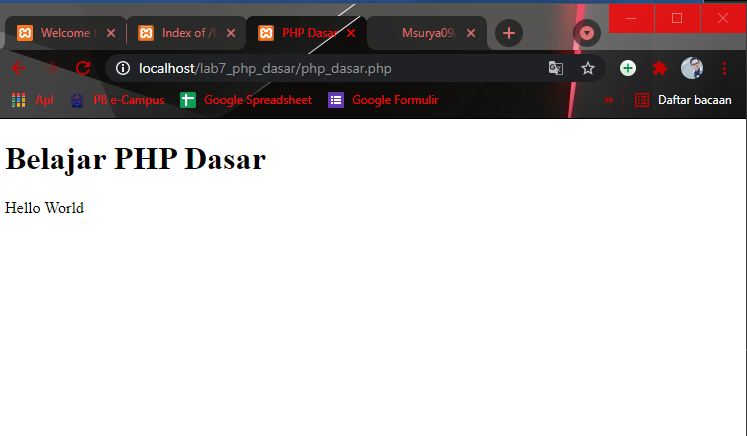

Variable PHP
Menambahkan variable pada program.

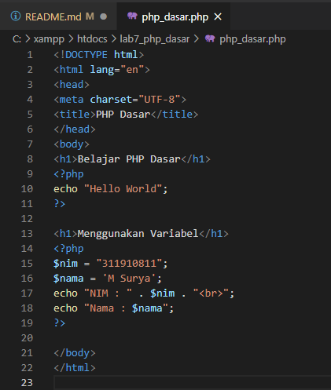

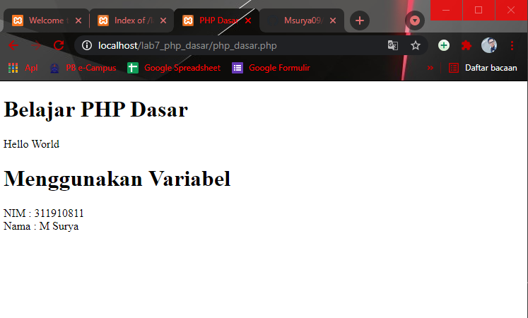

Predefine Variable $_GET

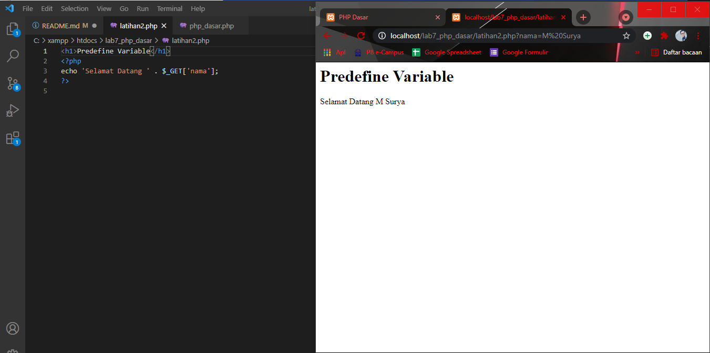

Membuat Form Input

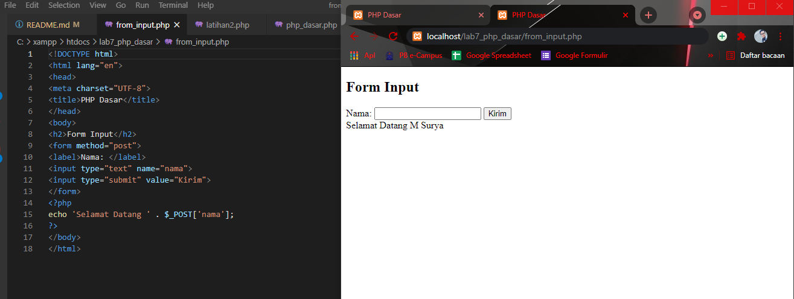

Tugas Membuat program PHP

membuat file index.php dengan script dibawah ini :

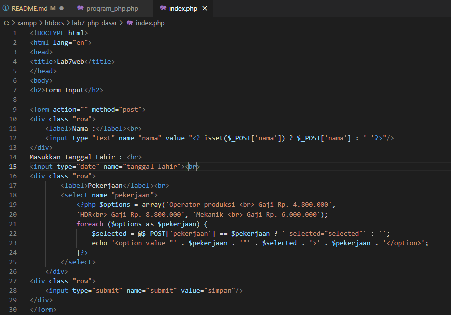

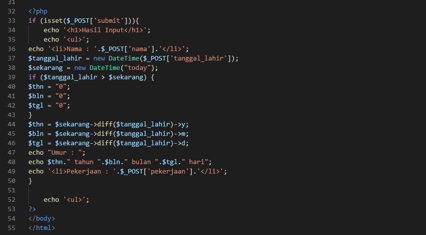

Maka tampilan yang akan didapatkan :

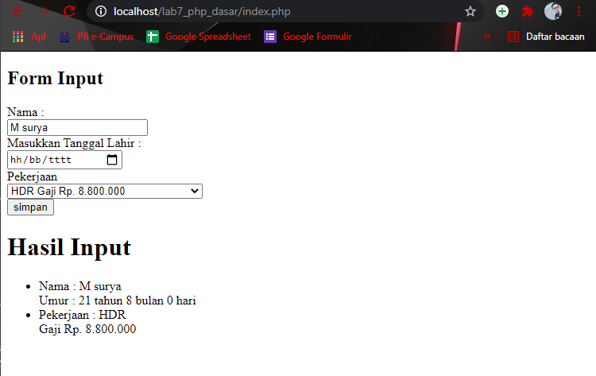